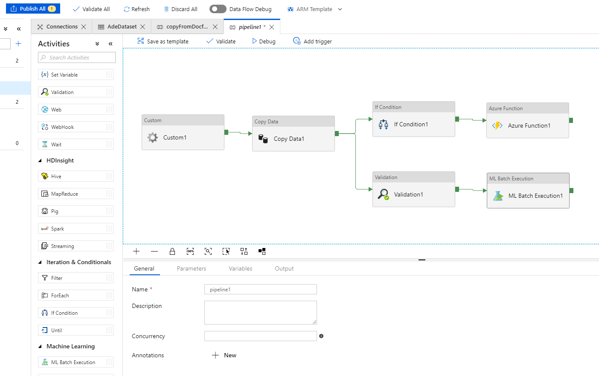

# Report On Azure Data Factory (ADF)

## Power of ADF

+ ETL (extract-transform-load) and data integration at scale
+ Support complex hybrid data source
+ Code free and easy, configuration directed (json form)
+ High modularity of functions and data flow view
+ Clear monitor of pipelines
+ ...

## Data-driven workflow


1. Connect&Collect (multiple accessors predefined)
2. Transform&Enrich: compute services such as HDInsight Hadoop, Spark, Data Lake Analytics, and Machine Learning, **supports custom codes** too
3. Publish: deployment and act
4. Monitor: built-in support, monitor via Azure Monitor, API, PowerShell, Azure Monitor logs, and health panels on the Azure portal.

## Basic concepts

+ Linked service
  + Define the connection to the data source (type of data)

``` An azure data explorer linked service example
{
    "name": "AdeLinkedService",
    "type": "Microsoft.DataFactory/factories/linkedservices",
    "properties": {
        "type": "AzureDataExplorer",
        "typeProperties": {
            "endpoint": "https://featureutilization.eastus.kusto.windows.net",
            "servicePrincipalId": "***",
            "database": "featureUtilization",
            "tenant": "**",
            "encryptedCredential": "***"
        },
        "annotations": []
    }
}
```

+ Dataset
  + Structures of data
  + Reference the data in the inputs or outputs of activities

``` An azure data explorer dataset example
{
    "name": "AdeDataset",
    "properties": {
        "linkedServiceName": {
            "referenceName": "AdeLinkedService",
            "type": "LinkedServiceReference"
        },
        "annotations": [],
        "type": "AzureDataExplorerTable",
        "structure": [
            {
                "name": "name",
                "type": "String"
            },
            {
                "name": "value",
                "type": "Double"
            },
            {
                "name": "timestamp",
                "type": "DateTime"
            },
            {
                "name": "customDimensions",
                "type": "String"
            }
        ],
        "typeProperties": {
            "table": "docfxLog"
        }
    },
    "type": "Microsoft.DataFactory/factories/datasets"
}
```

+ Activity and Pipeline
  + Activity: a unit of task (ADF has predefined many modules)
  + Pipeline: A logical grouping of activity
  + Custom control flow: sequence, branching, for-each, etc.



+ Triggers: determines when a pipeline execution needs to be kicked off
  + Manual run in portal / Rest API
  + Schedule trigger
  + Tumbling window trigger
  + Event-based trigger

> [!NOTE]
> Thinking: Pull and push mode in ADF
>+ Pull can be easily implemented by schedule or tumbling window trigger.
>+ Push is supported partially by event-based trigger. Now it only supports blob-create or blob-deletion event. For some data sources (Application Insights, event hub), push mode can be implemented by "event-based pull from blog logs" (Note: blog writing maybe be also delayed or scheduled).

+ Parameters:
  + Key-value pairs configuration
  + Assigned in the run context
  + Can be passed

See [an example](./Copy-Application-Insights-Data.md) of passing parameters (copy Application Insights data).

## Using my codes in ADF

There are two types of activities that you can use in an Azure Data Factory pipeline:

+ Data movement activities to move data between supported source and sink data stores
+ Data transformation activities to transform data using compute services such as Azure HDInsight, Azure Batch, and Azure Machine Learning.

When to use my code: To move data to/from a data store that Data Factory does not support, or to transform/process data in a way that isn't supported by Data Factory.

ADF supports three ways ([Azure Function Activity](https://docs.microsoft.com/en-us/azure/data-factory/control-flow-azure-function-activity), [Web Activity](https://docs.microsoft.com/en-us/azure/data-factory/control-flow-web-activity), [Custom Activities](https://docs.microsoft.com/en-us/azure/data-factory/transform-data-using-dotnet-custom-activity#feedback)) to insert your own code logic into the pipeline. All of them are wrapped as a module (an activity in the pipeline).

Name | Prerequisites | Input | Output| Limitations
--- | ------ | ----- | ----- | -----
Azure Function Activity | a function linked service connection;<br> HTTP triggered Azure Functions | request body | returned JObject | HTTP triggered required;<br> times out after 230 seconds;<br> not support passing linked services and datasets
Web Activity | a custom REST endpoint | datasets and linked services;<br> request body | returned JObject | not supported for URLs in a private virtual network;<br> timeout at 1 minute
Custom Activities | Azure Batch linked service;<br> your .exe in the Azure Batch pool | referenceObjects (linker services and datasets) and extendedProperties | stdout and stderr in blog container;<br> writing outputs.json | Azure Batch strong associated;<br> output size limit 2MB

> [!NOTE]
> Before using your own code logic in ADF, there may be some alternatives you might want to consider in ADF. ADF has already encapsulated a lot of commonly used logic in each module such as copy activity, filter activity, common data transformations (aggregate, join, select).
