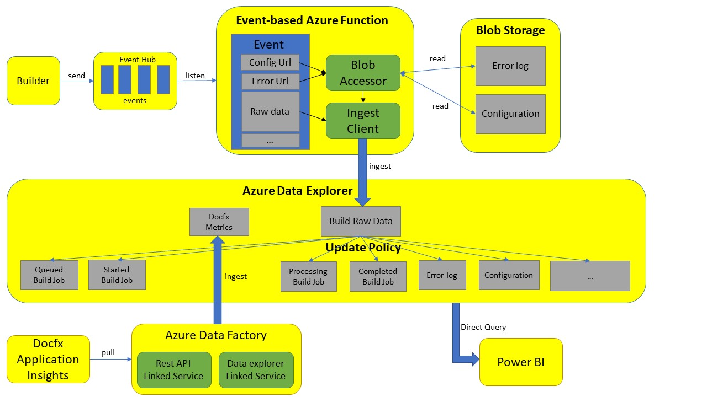

# Feature Utilization Design

## Data Source

### Current and Target Source

Data | Current | Target
- | - | -
Build raw data | Event Hub | Event Hub
Warning/Error log | Blob | Simplified in Event Hub;  Or still Complete in Blob
Build event configuration | None | Event Hub or Blob
Docfx log | Application Insights | Application Insights or Event Hub

### Other Source (Used for Demo now)

+ Builder exposing API: Get build event configuration
+ Github API: Sync previous configuration

## Data Storage

Azure Data Explorer (Kusto)

+ Fast and permanent
+ Support Structured, Semi-Sturctured and Unstructured data from
+ Design for large volumes of logs and data OLAP

## Current Workflow

1. Using Event Hub and event-based Azure Function to achieve push mode (real-time view).

2. Blob Storage can be used if the size of the content will exceed of the limit of event (1 MB). (error log, configuration)

3. Azure Data Explorer update policy can be used to help better integrating with the needs of powerBI. (data filtered view, query speed, logical partition)

4. Persist Docfx Application Insights Metrics data using Azure Data Factory (AI and Kusto data synchronization will be supported in the future).

5. Power BI directly queries data from Kusto (real-time view but many features are limited).

## Problems and Solutions

1. How to achieve low dependency?
Builder exposing API and Github API are minimized in the design.

2. How to make up for past data?
Github API can help to fetch previous configuration.
