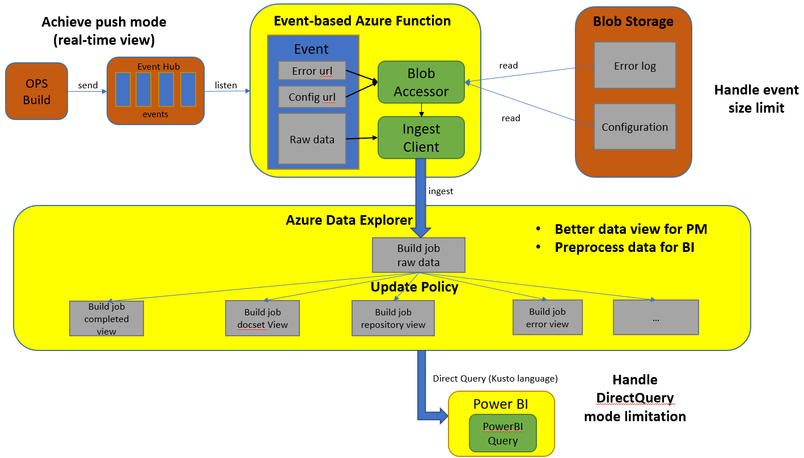
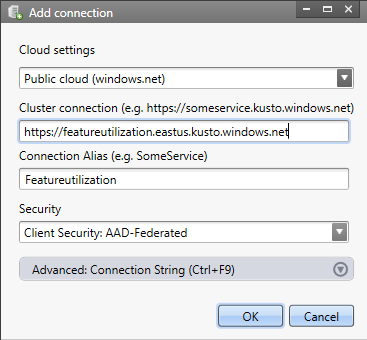

# Feature Utilization Transition

## Resouces

#### Repository

https://ceapex.visualstudio.com/Engineering/_git/Docs.FeatureUtilization (working branch, details in readme file)

#### Azure Resouces (PPE)

1. Subscription
Id: 939d5667-b96d-4142-b5d5-6449f5bd0bc3
Name: Open Publishing - Portal Sandbox
Resource group: featureUtilizationProject

2. Resource List

Type | Resource Name | Function
--|--|--
Key vault | [FeatureUtilization](https://ms.portal.azure.com/#@microsoft.onmicrosoft.com/resource/subscriptions/939d5667-b96d-4142-b5d5-6449f5bd0bc3/resourceGroups/featureUtilizationProject/providers/Microsoft.KeyVault/vaults/FeatureUtilization/overview)| Store credentials
Azure Data Explorer Cluster | [featureutilization](https://ms.portal.azure.com/#@microsoft.onmicrosoft.com/resource/subscriptions/939d5667-b96d-4142-b5d5-6449f5bd0bc3/resourceGroups/featureUtilizationProject/providers/Microsoft.Kusto/clusters/featureutilization)| Main data storage
Data factory (V2) |[featureUtilizationADF](https://ms.portal.azure.com/#@microsoft.onmicrosoft.com/resource/subscriptions/939d5667-b96d-4142-b5d5-6449f5bd0bc3/resourceGroups/featureUtilizationProject/providers/Microsoft.DataFactory/factories/featureUtilizationADF)| Used for docfx tracing synchronization task
App Service |[SyncBuildJobProd](https://ms.portal.azure.com/#blade/WebsitesExtension/FunctionsIFrameBlade/id/%2Fsubscriptions%2F939d5667-b96d-4142-b5d5-6449f5bd0bc3%2FresourceGroups%2FfeatureUtilizationProject%2Fproviders%2FMicrosoft.Web%2Fsites%2FSyncBuildJobProd)| Used for build job events synchronization task
Application Insights|[SyncBuildJobProd](https://login.microsoftonline.com/microsoft.onmicrosoft.com/oauth2/authorize?resource=https%3a%2f%2fmanagement.core.windows.net%2f&response_mode=form_post&response_type=code+id_token&scope=user_impersonation+openid&state=OpenIdConnect.AuthenticationProperties%3dwUmzdUCF3iC8_zv1SXMHFOz7y_3wDF_ysCcS5eWYpYaUh5gScq_J5gX9wQjfR-YssoHXI_RrRDx-FSZGx6ONTAqpAdfMQNt7KVtkvGYcODrdFrBnQy-GFeQw60901EKFBQjPWjQfuZDrk6sgNez1DK2_uj5j5idw-28kmi5RF5vcHFqqrQ4qeSuzlZA4aiiqNARKSVy5dLm6TS0vGypvvKO7RKHycHYqJzAeyUy4opX2texPsl_h1U3xhvn42EjsdiRI9qpAv_wcptJ5Y_oqHVjXBr3FfTg4HOU6RrG26fKZ6SmbHfajlUfPHN7HaVC-VKghPMG9S4HIsFVgfFRGqY1LU09yg4uHzt8NUmyhKNU&nonce=637042131557998295.OWVmMzQwZjAtMzczYi00ZGIxLTg2MzAtYTM4NGI4OGEyODE4NzZjNzk1ODktNDNiNi00MzFhLTk3ZGYtNDkwMTA3M2YwYzNj&client_id=c44b4083-3bb0-49c1-b47d-974e53cbdf3c&redirect_uri=https%3a%2f%2fms.portal.azure.com%2fsignin%2findex%2f%40microsoft.onmicrosoft.com%3ffeature.refreshtokenbinding%3dtrue%26feature.settingsportalinstance%3dmpac&site_id=501430&client-request-id=517f2b36-4f9b-40c5-bc23-90716affaec2&x-client-SKU=ID_NET&x-client-ver=1.0.40306.1554)| Used for monitoring App Service
App Service plan|[EastUSPlan](https://login.microsoftonline.com/microsoft.onmicrosoft.com/oauth2/authorize?resource=https%3a%2f%2fmanagement.core.windows.net%2f&response_mode=form_post&response_type=code+id_token&scope=user_impersonation+openid&state=OpenIdConnect.AuthenticationProperties%3dBT050XCvu4dXuHxc_0zrBiRd9r7fkH-f-f-ajZMhjXhLzN1ayIpaJkIobkcyNFIT9rJ8z9ag9K3gxTV-pXG1SY4SimI2tyeiz-bL17w5TG5jM-_PfcIcwYT-08pG7MPU4tAAaLmYEjYZkwM9UJ2WDvCYITjwfZMJStiec8Yd3F4Xmhu7xrwJHS2EHJiqU5OaqTMUEbmZULC-L8Sm4QKmsZljhAbErBorZ8_cdmJ65SrxzBmlvC9KYObbCAvvHIiY-PObyKim163KsN3p30BA0GPS54-hz2SC5OAz8ZQLX6cuxMHCsYgEkTEdBjh3j1fpW8qqBANEYnKEE5HhgzzF-_a-GjhDmFHjHbRw8LPT8LU&nonce=637042133000005745.NjhmMTNkYWYtMjk2Zi00NDYzLTk1Y2ItNDVhZDMxZDcxMWFlNDVhNDMxMmYtMDQzMC00MmFlLWI0YWUtZjRhOTgyNDFiYWIz&client_id=c44b4083-3bb0-49c1-b47d-974e53cbdf3c&redirect_uri=https%3a%2f%2fms.portal.azure.com%2fsignin%2findex%2f%40microsoft.onmicrosoft.com%3ffeature.refreshtokenbinding%3dtrue%26feature.settingsportalinstance%3dmpac&site_id=501430&client-request-id=517f2b36-4f9b-40c5-bc23-90716affaec2&x-client-SKU=ID_NET&x-client-ver=1.0.40306.1554)| App service consumer plan
Storage account|[featureutilization](https://login.microsoftonline.com/microsoft.onmicrosoft.com/oauth2/authorize?resource=https%3a%2f%2fmanagement.core.windows.net%2f&response_mode=form_post&response_type=code+id_token&scope=user_impersonation+openid&state=OpenIdConnect.AuthenticationProperties%3d7SVTTcrMd1dvr-LBSk3GHDFiIDztcQannv0ywY0arJhxct2LLQZ1WKVToUO_iQbtXZfPbEf_QBwKyycLMSkkjEi4XTDf76zpf4Ujtk7GqCYTz2uJPwCxaNvH7GgVUV0FZ3_U_wbO7wq04pIEBiaNK7LXVxqgpsCP1IoDgv5WrA0JlTeMx0miCKdvwfXzEEYNatI0eWMX1yMRnkIpgCYbfdbpLHHC6dOOP_1HLvMjhtL8L4xm3kYfhqy65-N83ec15LtMw5f0sQ3aDpdOk4mONY6Tcg-wEv_gTv-pnU4H1kYR8YR0VTYiIa-w-OD-oT_52ZY76G8vPmOIcWqBez7umyeZpUwrNjEGtfnRi5_8-zM&nonce=637042132213383714.MGFiMjY4MTYtZGEwZi00NDBlLWJiOGQtMGM3NmJiZDc0M2FkODVlMzU5NGUtNGQwMy00YWYwLWI0N2QtZjMxMjdhY2E0Yjhh&client_id=c44b4083-3bb0-49c1-b47d-974e53cbdf3c&redirect_uri=https%3a%2f%2fms.portal.azure.com%2fsignin%2findex%2f%40microsoft.onmicrosoft.com%3ffeature.refreshtokenbinding%3dtrue%26feature.settingsportalinstance%3dmpac&site_id=501430&client-request-id=517f2b36-4f9b-40c5-bc23-90716affaec2&x-client-SKU=ID_NET&x-client-ver=1.0.40306.1554)| Storage account for logs etc.

## Workflow

1.Use event-based Azure Function to listen buildjob raw data from Event Hub.
2.Read error log, configuration from blob.
3.Ingest buildjob raw data in Azure Data Explorer (Kusto).
4.Use Azure Data Explorer update policy to generate subtable data view for better query experience.
5.Power BI directly queries data from Kusto to support real-time view.

## Guidelines

#### Azure Data Explorer (Kusto)

1. Working Place

+ (Recommend) Use Kusto Explorer ([download](https://docs.microsoft.com/en-us/azure/kusto/tools/kusto-explorer)). Add connection to the database.

(Cluster connection: https://featureutilization.eastus.kusto.windows.net)
+ [Portal query url](https://ms.portal.azure.com/#@microsoft.onmicrosoft.com/resource/subscriptions/939d5667-b96d-4142-b5d5-6449f5bd0bc3/resourceGroups/featureUtilizationProject/providers/Microsoft.Kusto/clusters/featureutilization/databases/featureUtilization/data_explorer)
+ [Web query url](https://dataexplorer.azure.com/clusters/featureutilization.eastus/databases/featureUtilization)

2. Databases

+ featureUtilizaiton (sandbox data as source)
+ FeatureUtilizationProd (newest, production data as source)

3. Tables (FeatureUtilizationProd)

+ BuildJobRawData : raw data from buildjob Event Hub
+ BuildJobCompletedView : extracted data view from BuildJobRawData, storing completed buildjob data with publish config
+ BuildJobErrorView: extracted data view from BuildJobRawData, storing buildjob error data
+ BuildJobDocsetView: extracted data view from BuildJobRawData, storing buildjob docset data with related docfx config.

4. Functions
Four functions for updating “view” table using Kusto Update Policy (refer [here](https://docs.microsoft.com/en-us/azure/kusto/concepts/updatepolicy))

+ Sample query to show the function details: .show function UpdateBuildJobCompletedView (replaced by function name here)

5. Sample queries (query language refer [here](https://docs.microsoft.com/en-us/azure/kusto/query/))

+ Find docsets that use markdig engine: BuildJobDocsetView | where docfx_config.build.markdownEngineName =="markdig" | summarize arg_max(timestamp, *) by docset_name
+ Get average build duration of all completed build jobs in the last hour: BuildJobCompletedView| where timestamp > ago(1h)| summarize avg(building_duration)

6. Notice

+ Not every row of data in BuildJobRawData has configuration info (publish_config and docfx_config), due to that we are currently using personal OPS Build token (doesn’t have permissions of every repo) to get configuration info from OBS Build API.
When the configuration is written in blob with blob url in buildjob event in future, this won’t be a problem.

#### Power BI demos

+ BuildJobTracing report: https://msit.powerbi.com/groups/me/reports/c82d72b4-ea50-4adb-b881-3da4688e8cf5/ReportSection
+ Edit
    + In web: you can click in the interested visual and modify Filters in the right board.
    + In Power BI Desktop (download in Microsoft APP Store): you can download the report file in web and open it in Power BI Desktop to edit. Then publish it to web.
    + In Power BI Desktop: you can create your own report by importing the data in Kusto as source.

## Note

+ Permission: Kusto Database access, Azure function's key vault access

+ Setting: local environment and azure config

+ Data size limit: event, Kusto dynamic data type

+ BI query from Kusto: dynamic to data type, mv-expand